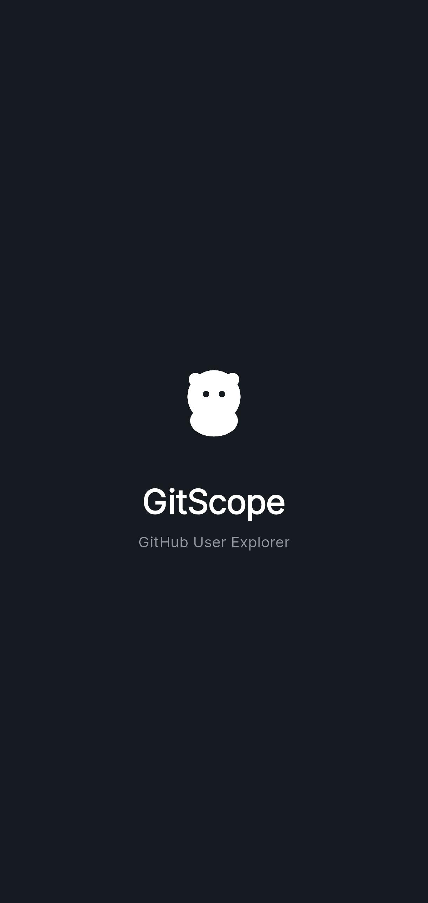
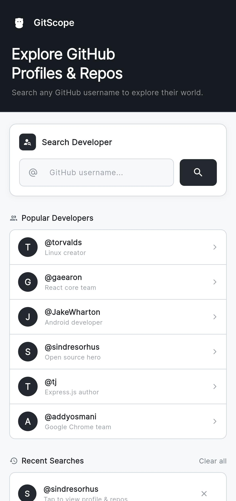
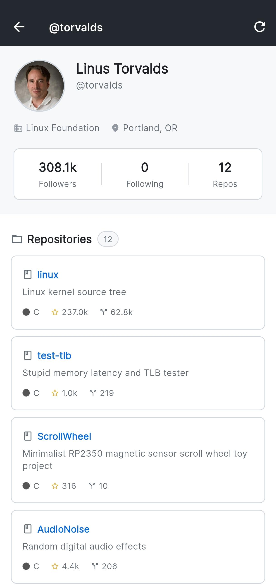

<div align="center">

# 🔭 GitScope

### A Sleek, GitHub-Inspired Explorer — Built with Flutter & GraphQL

*Explore GitHub profiles and repositories with a clean, native mobile experience powered by the GitHub GraphQL API.*

<br/>


</div>

---

## 📖 Overview

**GitScope** is a sleek, GitHub-inspired mobile app built with **Flutter** that lets you explore GitHub profiles and repositories using the **GitHub GraphQL API**. With a dark, professional UI inspired by GitHub itself, it makes browsing developers and their work feel right at home.

---

## ✨ Features

- 🔍 **Search GitHub Users** — Search any GitHub username to view their profile.
- 👤 **Profile View** — See avatar, bio, company, location, followers, following, and repo count.
- 📂 **Repository Explorer** — Browse all public repositories with language, stars, and forks.
- 🔗 **Open in GitHub** — Tap any repository to open it directly in the browser.
- 📜 **Infinite Scroll** — Repositories load automatically as you scroll.
- 🕐 **Recent Searches** — Your search history is saved locally and persists across app restarts.
- ⭐ **Popular Developers** — Quick access to famous GitHub developers like Linus Torvalds, Dan Abramov, and more.
- 🎨 **GitHub-Themed UI** — Dark AppBar, clean cards, and a professional color palette inspired by GitHub.

---

## 🏗️ Architecture

This project follows **Clean Architecture** with a feature-based folder structure:

```
lib/
├── core/             # Theme, constants, errors, GraphQL client
├── features/
│   ├── profile/      # User profile (domain → data → presentation)
│   ├── repositories/ # Repo list with pagination
│   └── search/       # Home screen & recent searches
├── router/           # GoRouter navigation
├── shared/           # Reusable widgets (LanguageBadge, ErrorView, etc.)
└── splash/           # Splash screen
```

---

## 🛠️ Tech Stack

| Technology                      | Purpose                          |
|----------------------------------|-----------------------------------|
| **Flutter**                      | Cross-platform UI                |
| **Riverpod** (with code gen)      | State management                 |
| **GraphQL** (`graphql_flutter`)   | GitHub API integration           |
| **GoRouter**                     | Declarative routing              |
| **Google Fonts** (Inter)         | Typography                       |
| **shared_preferences**            | Local persistence                |
| **url_launcher**                  | Open repos in browser            |
| **Freezed**                       | Sealed classes for error types   |

---

## 🚀 Getting Started

### Prerequisites

- Flutter SDK `>= 3.7.0`
- A [GitHub Personal Access Token (Classic)](https://github.com/settings/tokens/new) with `public_repo` and `read:user` scopes.

### Setup

1. **Clone the repository:**
   ```bash
   git clone https://github.com/MohibKhorajiya01/gitscope.git
   cd gitscope
   ```

2. **Install dependencies:**
   ```bash
   flutter pub get
   ```

3. **Set up your GitHub token:**

   Create a `.env` file in the project root:
   ```env
   GITHUB_TOKEN=your_github_token_here
   ```

   > ⚠️ The `.env` file is in `.gitignore` — your token will never be pushed to GitHub.

4. **Run the app:**
   ```bash
   flutter run
   ```

---

## 📸 Screenshots

<p align="center">
  
  
  
  
</p>

---

<div align="center">

### 💜 Built with passion using Flutter & GraphQL

**GitScope** — *Explore the world of code, one profile at a time.*

</div>
